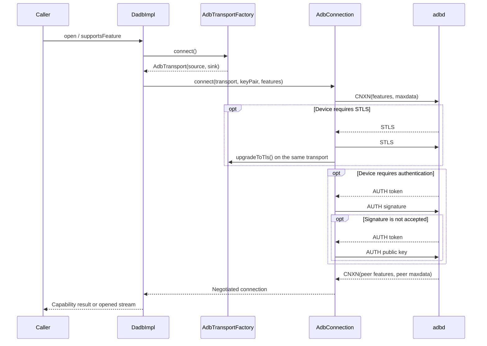

# dadb Architecture, Responsibilities, and Runtime Flows

This document is the maintenance entry point for dadb. It defines module boundaries, connection
and data flows, resource lifecycles, and where new or changed behavior belongs. The README contains
usage examples and public API guidance; this document covers implementation responsibilities and
runtime behavior.

## 1. System Boundary

dadb is a Kotlin/Java library that speaks the ADB protocol directly. It can connect directly to
`adbd` or access a device through a host-side `adb server`. Android-specific capabilities live in a
separate module and must not leak Android dependencies into the JVM protocol core.

The caller owns product policy. dadb owns protocol and resource mechanisms:

| Area                        | dadb owns                                                                             | Caller owns                                                   |
|-----------------------------|---------------------------------------------------------------------------------------|---------------------------------------------------------------|
| Device selection            | Endpoint, transport, and `adb server` discovery primitives                            | Which device to connect to and when to switch                 |
| Identity and authentication | Key loading/generation, ADB AUTH, Android identity storage                            | Storage location, rotation policy, and user prompts           |
| TLS                         | STLS upgrade, TLS handshake, configurable certificate validation                      | TOFU, pinning, identity-change alerts, and other trust policy |
| ADB streams                 | Stream IDs, message routing, flow control, and stream closure                         | Services to open, open order, and business-level retries      |
| Failure reporting           | Connection, authentication, protocol, and timeout exceptions; typed operation results | Retry, fallback, logging, and user-facing behavior            |
| Lifecycle                   | Transport, connection, stream, and internal-thread shutdown                           | Closing each `Dadb`, `DadbSession`, and `AdbStream` owner     |

dadb does not own UI, session configuration, persisted device trust, or global reconnection policy.
It also does not understand socket roles in higher-level protocols such as scrcpy.

## 2. Module Responsibilities

### `dadb`

The pure JVM core module owns:

- `Dadb`: public entry point for service streams, shell, sync, install/uninstall, forwarding, and
  reverse forwarding.
- `DadbSession`: one logical device session backed by a primary connection and an optional
  streaming connection. It owns background warm-up, shared concurrent waiting, retry after setup
  failure, single-connection reuse, and unified shutdown. Callers select a purpose with
  `DadbRoute`; they do not own the physical connections.
- `DadbImpl`: lazily creates and reuses one ADB connection, rebuilds its transport after failure,
  and retries `open()` once only when the old connection is demonstrably stale.
- `AdbConnection`: performs CNXN, optional STLS, AUTH, feature and `maxdata` negotiation, and local
  stream ID allocation.
- `AdbReader` / `AdbWriter`: strict ADB packet reading, validation, encoding, and serialized writes.
- `AdbMessageQueue`: routes messages from one physical connection by local ID and command.
- `AdbStreamImpl`: maps OPEN/OKAY/WRTE/CLSE to Okio `source`/`sink` and implements classic ACK or
  `delayed_ack` byte-window flow control.
- `AdbTransport` / `AdbTransportFactory`: raw bidirectional byte channels. The core provides a TCP
  transport by default.
- `adbserver`: selects devices and opens services through a host-side `adb server`. This path does
  not run dadb's direct CNXN/AUTH state machine because the server owns that handshake and device
  transport.
- Forwarding, sync, shell, result, and exception types built on the stream mechanism.

The core module must not depend on the Android SDK. A new platform transport should implement
`AdbTransportFactory` instead of adding platform APIs to `dadb`.

### `dadb-android`

The Android integration module owns:

- `storage`: maintains `adbkey` and `adbkey.pub` under an app-private directory chosen by the
  caller.
- `runtime`: `AdbRuntime` combines identity, pairing, mDNS, USB, and TLS transports. Its network
  session factory creates a classic-ACK primary connection plus a delayed-ACK streaming connection;
  its USB session factory creates a single reused connection. It is a convenience layer, not a new
  protocol layer.
- `usb`: discovers the ADB interface and endpoints through Android USB Host APIs and adapts them to
  the core transport abstraction.
- `tls`: provides an STLS-capable transport that upgrades the same TCP socket, plus trust managers,
  pin helpers, and error mapping.
- `wireless`: Wireless Debugging pairing, one-shot discovery, and continuous mDNS monitoring.
- `cpp/pairing`: native code required by the pairing protocol.

`AdbRuntime` does not persist whether an endpoint is trusted or retain historical certificate pins.
Applications that need TOFU, pin comparison, or identity-change alerts must implement and persist
that policy explicitly through `AdbRuntimeOptions`.

### `dadb-helper`

This module builds a helper JAR that can be pushed to an Android device and launched with
`app_process`:

- `TcpRelayMain`: listens on device loopback and relays TCP. It is not an ADB transport and does not
  own the host-side connection.
- `AppIconExportMain`: queries application metadata and exports icon data on the device.

Only work that must execute inside a target-device process belongs here. Host/client protocol code,
Android USB/TLS integration, and business orchestration do not.

## 3. Direct ADB Connection Flow

`Dadb.create(...)` creates a handle. The physical connection is normally established lazily by the
first `open()`, `supportsFeature()`, or `isTlsConnection()` call.



After the handshake, the connection records negotiated facts:

- peer-supported features;
- whether both peers enabled `delayed_ack`;
- the negotiated protocol version;
- the payload limit, `min(peer maxdata, transport maxdata)`;
- whether TLS was actually established.

Caller configuration must not overwrite these negotiated facts.

### STLS and Authentication Order

The order is fixed: initial CNXN -> optional STLS/TLS -> optional AUTH -> final CNXN. STLS must
upgrade the same underlying connection. It must not close the socket and create a new TLS
connection. If the device requires STLS and the transport does not implement
`TlsUpgradableAdbTransport`, connection setup fails.

### Protocol Markers and Version/Capability Negotiation

The code's `CMD_*` constants correspond to the `A_*` names commonly used in ADB protocol material.
When inspecting captures, logs, or handshake state, treat commands, versions, and features as three
separate dimensions rather than one "connection version":

| Meaning                                    | Code marker | Common ADB marker | Value        | Purpose                                        |
|--------------------------------------------|-------------|-------------------|--------------|------------------------------------------------|
| Establish connection / report capabilities | `CMD_CNXN`  | `A_CNXN`          | `0x4e584e43` | Initial request and final handshake completion |
| Request in-place TLS upgrade               | `CMD_STLS`  | `A_STLS`          | `0x534c5453` | Enters the TLS upgrade branch                  |
| ADB authentication                         | `CMD_AUTH`  | `A_AUTH`          | `0x48545541` | Token, signature, and public-key exchange      |
| Open a logical service                     | `CMD_OPEN`  | `A_OPEN`          | `0x4e45504f` | Starts a stream after TLS/authentication       |
| Accept stream / acknowledge flow control   | `CMD_OKAY`  | `A_OKAY`          | `0x59414b4f` | Accepts a stream or returns window credit      |
| Stream data                                | `CMD_WRTE`  | `A_WRTE`          | `0x45545257` | Carries application payload                    |
| Close stream                               | `CMD_CLSE`  | `A_CLSE`          | `0x45534c43` | Rejects an open or terminates a stream         |

Two independent negotiations happen during setup:

1. **Transport security upgrade.** After initial `A_CNXN`, the device may send `A_STLS`. dadb
   answers with `A_STLS` and performs TLS on the same socket. A successful upgrade sets
   `tlsUpgraded=true`, exposed as `Dadb.isTlsConnection()==true`.
2. **ADB packet version.** The client advertises `CONNECT_VERSION` in `A_CNXN.arg0` and uses
   `min(peerVersion, CONNECT_VERSION)` after final `A_CNXN`. This supports an older ADB packet
   version; it is not a fallback from TLS to plaintext.

Current version markers:

| Marker                    | Value                     | Behavior                                            |
|---------------------------|---------------------------|-----------------------------------------------------|
| `A_VERSION_MIN`           | `0x01000000`              | Legacy packet rules; write payload checksums        |
| `A_VERSION_SKIP_CHECKSUM` | `0x01000001`              | New packet rules; write `0` in the checksum field   |
| `CONNECT_VERSION`         | `A_VERSION_SKIP_CHECKSUM` | Highest packet version currently advertised by dadb |
| `STLS_VERSION`            | `0x01000000`              | Lowest STLS version currently accepted by dadb      |

After version negotiation, `AdbWriter.updateProtocolVersion()` selects checksum behavior. `maxdata`
is negotiated separately and must not be inferred from the version.

Features are not versions either. Both peers advertise `shell_v2`, `cmd`, `abb_exec`,
`delayed_ack`, and other features in their CNXN banners. Code must test the relevant feature.
`delayed_ack` is enabled only when both peers advertise it; otherwise streams use classic
per-packet `OKAY` flow control.

TLS never silently downgrades:

- If the device returns final `A_CNXN` directly, the connection stays plaintext and
  `isTlsConnection()` is `false`. The device did not request STLS; this is not fallback after a TLS
  failure.
- If the device sends `A_STLS` but the transport cannot upgrade, the STLS version is unsupported,
  the TLS handshake fails, or certificate policy rejects the peer, setup fails and resources are
  closed. dadb must not continue in plaintext on that endpoint.
- Once TLS succeeds, AUTH, final CNXN, and all stream packets use the upgraded source and sink.
  There is no connection-local path back to plaintext.
- `AdbServerDadb.isTlsConnection()` always returns `false` because the host protocol cannot observe
  whether the `adb server`-to-device leg uses TLS. It does not prove that leg is plaintext.

## 4. Stream Opening and Data Flow

One direct ADB connection can carry multiple logical streams. Each stream has independent local and
remote IDs and message routing.

### Opening

1. `AdbConnection` allocates a local ID and registers a listener with `AdbMessageQueue`.
2. It writes `OPEN(localId, destination)`.
3. It waits for `OKAY` with the same local ID. `CLSE` becomes `AdbStreamOpenException`.
4. It reads the remote ID from `OKAY`; with `delayed_ack`, it also reads the initial send window.
5. It creates `AdbStreamImpl`, exposing subsequent messages through `source` and `sink`.

The listener must be registered before OPEN is sent, or a fast device response can arrive before
the listener exists and be lost.

### Reading

1. `AdbReader` reads and validates complete ADB packets from the transport.
2. `AdbMessageQueue` routes them by the local ID in `arg1`.
3. The stream `source` waits for WRTE and lets callers consume a payload across multiple reads.
4. Classic ACK returns OKAY after a complete WRTE is consumed; `delayed_ack` returns the number of
   bytes actually consumed.
5. CLSE or a connection-level failure ends reading and unregisters the listener.

### Writing

1. The stream `sink` splits data into payloads no larger than negotiated `maxdata`.
2. Classic ACK waits for the matching OKAY after every WRTE.
3. `delayed_ack` writes while byte-window credit remains and waits for a byte-count OKAY when the
   window is exhausted.
4. `flush()` completes current buffered writes. Stream closure sends CLSE and unregisters the
   listener.

Multiple streams may transfer concurrently, but the underlying `AdbWriter` serializes packet writes
so packet bytes cannot interleave.

### ACK Flow-Control Modes and the `delayed_ack` Marker

These are two ADB stream flow-control modes, not two transports, TLS modes, or packet versions. The
negotiation marker is the `delayed_ack` feature in the initial CNXN banner.

| Mode                     | Negotiated state                             | `A_OPEN` / `A_OKAY` form                                                                         | Send behavior                                                      | Typical load                                                          |
|--------------------------|----------------------------------------------|--------------------------------------------------------------------------------------------------|--------------------------------------------------------------------|-----------------------------------------------------------------------|
| Classic per-packet ACK   | Either peer omits `delayed_ack`              | `A_OPEN.arg1=0`; `A_OKAY` has no payload                                                         | Send one `A_WRTE`, wait for one `A_OKAY`                           | Interactive shell, small commands, compatibility path                 |
| Delayed ACK / burst mode | Both CNXN feature sets contain `delayed_ack` | `A_OPEN.arg1` advertises receive window; `A_OKAY.payload` is a four-byte acknowledged byte count | Send multiple WRTE packets while available send bytes (ASB) remain | scrcpy, file transfer, sustained media, other high-throughput streams |

Classic mode allows only one unacknowledged WRTE:

```text
Host  -> A_WRTE(a) -> Device
Host  <- A_OKAY    <- Device
Host  -> A_WRTE(b) -> Device
Host  <- A_OKAY    <- Device
```

Delayed ACK uses byte credit, allowing several writes before consumed credit is returned:

```text
Host  -> A_OPEN(arg1=32 MiB)   -> Device
Host  <- A_OKAY(payload=ASB)    <- Device
Host  -> A_WRTE(a)              -> Device
Host  -> A_WRTE(b)              -> Device
Host  -> A_WRTE(c)              -> Device
Host  <- A_OKAY(payload=len(a)) <- Device
Host  <- A_OKAY(payload=len(b)) <- Device
```

Current dadb rules:

1. `Dadb.connectFeatures(withDelayedAck = true)` advertises `delayed_ack` by default. Pass `false`
   for compatibility or diagnosis.
2. `AdbConnection` enables the mode only when both local and peer features contain it. One side
   cannot force the mode.
3. A locally opened stream advertises a 32 MiB initial receive window through `A_OPEN.arg1`.
4. The peer's first `A_OKAY.payload` initializes local ASB. Every payload sent subtracts its byte
   count.
5. Sending stops when ASB reaches zero and resumes after later `A_OKAY.payload` credit. The reader
   returns credit according to bytes actually consumed.
6. In delayed-ACK mode, `A_OKAY.payload` must be exactly four bytes. In classic mode it must be
   empty. A shape mismatch is a protocol failure; dadb must not guess or switch modes silently.

The selection is connection-wide, not per stream at `open()` time. Shell still works on a
delayed-ACK connection. Saying that classic mode suits shell and delayed ACK suits scrcpy describes
load characteristics; it does not imply conflicting interpretations within one connection. For
scrcpy, the caller must still open `video -> optional audio -> control` strictly in sequence. That
ordering is independent of ACK mode.

### dadb Dual-Connection Sessions and Screen Remote Routing

ADB cannot switch an established connection from classic ACK to delayed ACK because the mode is
selected by the CNXN features exchanged during connection setup. `DadbSession` therefore combines
two internal `Dadb` handles into one logical device session for network transports:

| Logical route | Local feature choice   | Setup time                                                                        | Intended traffic                                              |
|---------------|------------------------|-----------------------------------------------------------------------------------|---------------------------------------------------------------|
| Primary       | `withDelayedAck=false` | Connect and verify first; the app becomes usable immediately                      | Normal shell, device inspection, and management operations    |
| Streaming     | `withDelayedAck=true`  | Warm in the background after primary success; streaming callers wait if necessary | scrcpy server push/start, forwarding, and video/audio/control |

Each network connection independently performs CNXN, optional STLS/TLS, AUTH, and feature
negotiation. `withDelayedAck=true` expresses local capability; if adbd does not advertise
`delayed_ack`, dadb uses classic ACK on that streaming connection. This is negotiated capability
fallback, not a dynamic mode switch on an established socket.

`DadbSession` owns connection creation, shared waiting, retry after setup failure, and shutdown.
`AdbRuntime.connectNetworkDadbSession()` creates the network session with both feature sets;
`createUsbDadbSession()` creates a USB session whose two routes share the primary connection. The
caller owns one `DadbSession` and must not close an internal connection returned by `route()`.

Routing is selected by operation purpose, not by inspecting payload content. Unqualified `Dadb`
operations and `DadbRoute.PRIMARY` use the primary connection; sustained traffic explicitly selects
`DadbRoute.STREAMING`. Screen Remote sends general shell work through the primary route and its
scrcpy-specific shell, socket, push, and forward operations through the streaming route. dadb does
not understand scrcpy socket roles. Screen Remote still opens video, audio, and control strictly in
sequence on the same streaming route.

Android USB Host does not create a second physical connection because it exclusively claims one ADB
interface. Primary and streaming routes therefore share one delayed-ACK-enabled `Dadb` connection.

Failure handling is intentionally simple:

- `1 + 0` (primary ready, streaming unavailable): normal app work continues; streaming work waits
  for or retries streaming setup.
- `0 + 1` (primary failed, old streaming connection still alive): the logical session is failed and
  the session layer rebuilds it. The streaming connection is not silently promoted to primary.
- `0 + 0`: close both routes and their streams/forwards, then rebuild primary-first.

A failed background streaming setup must not close the primary connection. A later streaming-route
request can start a new attempt. Closing the logical session must continue releasing remaining
resources even if one connection or forward fails to close. The steady-state cost is one additional
TCP/TLS/ADB session and minor keepalive traffic; it does not duplicate scrcpy media traffic.

### One-Time `open()` Retry Boundary

`DadbImpl` discards the current physical connection and retries once only when a closed connection,
timeout, EOF, broken pipe, or similar evidence proves that the reused connection is stale. It does
not automatically retry:

- a service rejected by the device;
- authentication failure;
- protocol failure;
- a second open failure.

This is connection recovery, not business retry. Callers must not rely on it to restart a stateful
service or recover a role-ordered group of streams.

## 5. Transport Flows

### Direct TCP

`Dadb.create(host, port)` -> TCP socket -> direct `AdbConnection` handshake -> service stream.

Use this for an emulator or a device exposing a plain ADB TCP port. Modern Wireless Debugging STLS
requires an upgrade-capable TLS transport rather than the plain socket transport.

### Host-Side `adb server`

`AdbServer.createDadb(...)` -> connect to `adb server:5037` -> select device -> request service ->
expose the socket as `AdbStream`.

Every `open()` creates a new socket to `adb server`. The host process owns discovery, USB,
authentication, and the adbd connection. `AdbServerDadb` owns only the server host protocol and the
public `Dadb` interface.

### Android USB Host

1. The caller obtains USB permission and selects a `UsbDevice`.
2. `UsbTransportFactory` creates `UsbChannel`, claims the ADB USB interface, and selects bulk
   endpoints.
3. `UsbSource` / `UsbSink` adapt USB to Okio. The sink gives only complete ADB packets to the USB
   channel.
4. Core `AdbConnection` performs CNXN/AUTH on that transport.
5. Closing `Dadb` releases streams, connection, USB channel, and claimed interface.

`AdbRuntime.createUsbDadb()` performs a capability query before returning to warm the transport and
retries initial connection failure a limited number of times. USB permission and device selection
remain caller responsibilities. `createUsbDadbSession()` wraps that one connection for both routes.

## 6. Wireless Debugging Flow

Wireless Debugging has two different ports and phases. They are not one connection:


Responsibility split:

- `AdbMdnsDiscoverer`: blocks until the first matching endpoint; suited to one-shot discovery.
- `AdbMdnsMonitor`: exposes continuous `StateFlow` state for service appearance, resolution, loss,
  and shutdown.
- `WirelessDebugPairingClient`: handles only the pairing port and returns the peer public key and an
  observable TLS pin.
- `AdbRuntime.connectNetworkDadb()`: creates an STLS-capable transport with the same ADB key pair,
  warms the handshake, and returns it.
- Application: selects the mDNS service, persists endpoint/trust state, and decides when to pair
  again.

Successful pairing does not mean the business connection exists. Pairing and connect services
normally use different ports, and those ports may change when Wireless Debugging is re-enabled.

## 7. Ordering Responsibility for Higher-Level Multi-Stream Protocols

dadb guarantees the ADB semantics of one `Dadb.open(destination)` call. It does not know the roles
of several destinations in a higher-level protocol. Protocols that assign roles by server-side
`accept()` order must therefore be opened strictly sequentially by the caller.

For example, scrcpy sockets have no client role handshake. The caller must wait for each open to
complete in this order:

1. `video`;
2. `audio`, when enabled;
3. `control`.

Do not launch concurrent `open()` calls or assign roles by completion order. If one role fails,
restarting the server, changing SCID, or rebuilding the group is caller session policy. dadb must
not guess.

## 8. Closure, Concurrency, and Failure Contracts

### Closure Hierarchy

- `AdbStream.close()`: sends CLSE and unregisters the current local ID.
- `AdbConnection.close()`: stops reverse threads, wakes waiters, and closes reader, writer, and
  transport.
- `Dadb.close()`: closes and clears its reused connection. Old streams must not be retained.
- `DadbSession.close()`: closes both owned connections independently and stops streaming setup.
- `AdbRuntime`: owns no global active connection. The caller closes every returned `Dadb` or
  `DadbSession`.
- `AdbMdnsMonitor.close()`: stops discovery and must follow its owning Android lifecycle.

### Concurrency Constraints

- One connection may carry multiple streams.
- `AdbMessageQueue` coordinates packet reads; `AdbWriter` serializes packet writes.
- Stream read/write flow control is stateful. Multiple uncoordinated writers must not share one
  sink.
- In-place TLS upgrade occurs only during the initial handshake, never after streams exist.
- Closure must wake threads waiting for messages or ACK credit.
- Concurrent `DadbSession.route(STREAMING)` callers share one connection attempt.

### Error Model

Connection, authentication, protocol, timeout, and transport failures use `AdbException` subtypes.
Install, uninstall, sync, root, and similar operations that complete at the protocol layer but
report an unsuccessful result return the relevant `*Result.Failure`. New APIs must preserve this
distinction instead of using string matching or a generic `Result<Boolean>` that hides the failure
stage.

## 9. Change Placement Rules

| Change                                                        | Correct location                     | Incorrect location        |
|---------------------------------------------------------------|--------------------------------------|---------------------------|
| ADB packets, handshake, streams, shell, sync, forwarding      | `dadb`                               | Android runtime or helper |
| Generic dual-connection ownership and routing                 | `dadb` (`DadbSession`)               | Product application       |
| Generic byte-channel abstraction                              | `dadb` transport interfaces          | Product application       |
| Android USB/NSD/KeyStore/TLS adaptation                       | `dadb-android`                       | JVM core                  |
| Pairing and Android identity convenience orchestration        | `dadb-android/runtime` or `wireless` | `DadbImpl`                |
| Logic that must run inside the target device                  | `dadb-helper`                        | Host transport            |
| Device selection, session recovery, UI, persisted trust state | Caller application                   | dadb                      |
| scrcpy socket role order and server/SCID lifecycle            | Caller application                   | dadb stream layer         |

Before adding a wrapper, confirm that it owns real policy, platform isolation, or multiple
consumers. Do not add a `Manager` or `Facade` that only forwards calls without owning a decision.

## 10. Verification Entry Points

Choose the smallest relevant checks, then run the complete suite when its device prerequisites are
available:

- Handshake/authentication/TLS: `AdbConnectionHandshakeTest`, `AdbConnectionTransportTest`,
  `AdbRuntimeTransportTest`, `AdbTlsSocketsTest`.
- Session ownership/routing: `DadbSessionTest`.
- Streams/queues/flow control: `AdbStreamTest`, `MessageQueue*Test`, `WriteTimeoutTest`.
- Shell/sync/install results: `DadbShellBehaviorTest`, `AdbSyncBehaviorTest`,
  `DadbInstallBehaviorTest`, `ResultTypesTest`.
- `adb server`: `AdbServerTest`, `AdbServerForward*Test`.
- Android USB: `AdbPacketCodecTest`, plus real-device permission, setup, and release checks.
- Pairing/mDNS: `AdbPairingProtocolTest`, `AdbMdnsRegistryTest`,
  `AndroidAdbMdnsMonitorExecutorTest`, plus real-device Wireless Debugging checks.

The complete repository command is:

```shell
./gradlew check
```

USB, NSD, pairing, TLS interoperability, and vendor-ROM behavior require real Android device
verification. JVM tests do not replace those checks; delivery notes must identify untested device
scenarios.

## 11. Protocol References

- [AOSP ADB command and ADB/STLS version constants](https://android.googlesource.com/platform/packages/modules/adb/+/refs/heads/main/adb.h)
- [AOSP Wireless Debugging architecture](https://android.googlesource.com/platform/packages/modules/adb/+/refs/heads/main/docs/dev/adb_wifi.md)
- [AOSP delayed ACK / burst mode design](https://android.googlesource.com/platform/packages/modules/adb/+/499678c3d5de5049d9323491f2caf8a5cb61ada6/docs/dev/delayed_ack.md)
